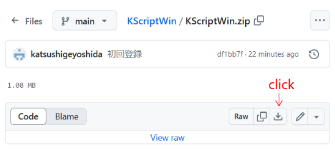
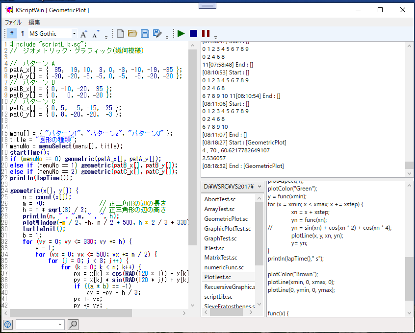
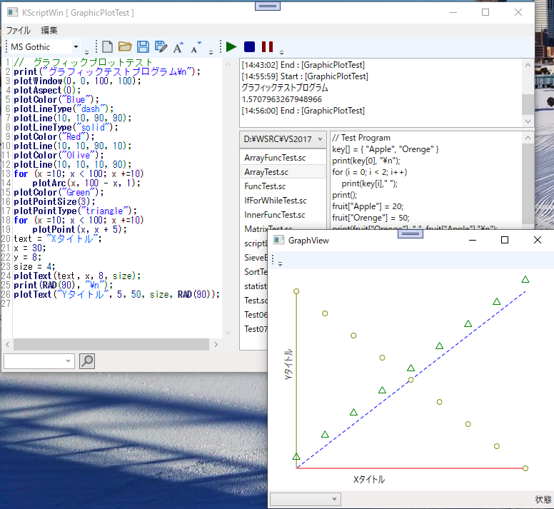

# KScriptWin
##  C言語風のスクリプト言語とその実行環境

KScript はC言語に似せたスクリプト言語でインタプリタとして動作する。
自前のCADソフト(CadAppやMin3DCad)に組み込んで動作させることを目的に作成した。
基本的な制御構造と型指定のない変数で作られている。
KScriptWin はWindows上でKScriptのコード作成とそれを実行する環境である。
  
使い方などは[説明書](Document/KScriptWinManual.pdf)を参照。  
実行方法は[KScriptWin.zip](KScriptWin.zip)をダウンロードし適当なフォルダーに展開して KScriptWin.exe を実行する。  

### KScriptの特徴
・インタプリタであること  
・記述は C に近く、文法はシンプルでわかりやすい  
・変数、配列の宣言は不要  
・変数で数字との文字列の区別をしない  
・配列は２次元まで    
・配列の値に数値と文字列の混在か可能  
・配列のインデックスに文字列か使用できる  
・変数名、配列名、配列のインデックスに日本語が使用できる  
・グローバル変数とローカル変数を名前の指定で使い分けられる  
・#include文で関数の汎用化ができる  

### KScriptWinの特徴
・コーディング(エディタ)と実行環境がセットとなっている  
・同じ環境でテキストファイルの参照ができコーディングの参考にできる  
・エディタでは関数名などを入力候補から選択できる  
・おなじ環境でグラフィック機能が使える  
・グラフィック機能が簡単に使用できる(直接ワールド座標が使えスクリーン座標を考慮する必要がない)  

### 画面
メインウィンドウ    
  

グラフィック表示  
  

### 履歴
2024/10/24 コメント追加/解除(ctrl+/)  
2024/10/23 exit を例外処理(throw)で組み込む   
2024/10/20 グローバル変数は変数名の先頭に「g_」をつけることで対応  
2024/10/13 ファイル参照機能  
2024/10/10 エディタでの入力候補機能2024/10/06 グラフィック関数  
2024/10/13 ファイル参照機能  
2024/10/06 ダイヤログ関数 (input,message)  
2024/10/04 中断、一時停止機能  
2024/09/30 エディタのフォント選択、検索、  
2024/09/29 スクリプトの作成にAvalonEditorを使用,print文をコールバック関数にして実行側で出力先を選択  
2024/09/27 Console版から移植で作成開始  

### ■実行環境
[KScriptWin.zip](KScriptWin.zip)をダウンロードして適当なフォルダに展開し、フォルダ内の KScriptWin.exe をダブルクリックして実行します。  
動作環境によって「.NET 8.0 Runtime」が必要になる場合もあります。  
https://dotnet.microsoft.com/ja-jp/download

### ■開発環境  
開発ソフト : Microsoft Visual Studio 2022  
開発言語　 : C# 10.0 Windows アプリケーション  
フレームワーク　 :  .NET 8.0  
NuGetライブラリ : AvalonEditor  
自作ライブラリ  : CoreLib (express,YWordDraw,YDraw,InputBox,MenuDialog)  
